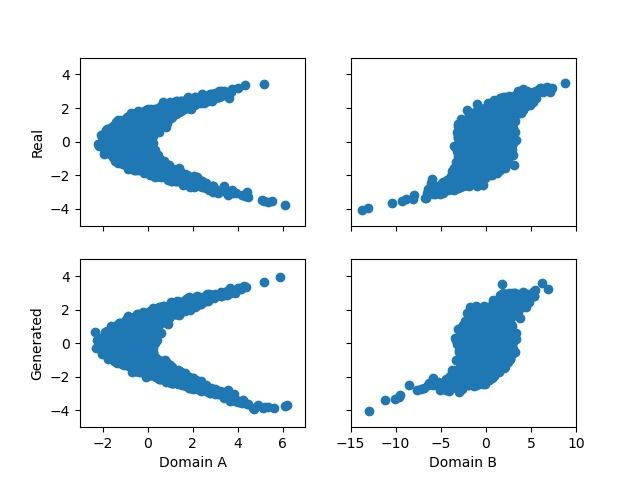

# Translation
Unsupervised domain translation using invertible nets with strict MLE training. This project is currently under development.

## Existing methods
The following methods have been implemented in my pytorch lightning setup:
| Method    | Link to project |
|-----------|-----------------|
| CycleGAN  | https://junyanz.github.io/CycleGAN/ |
| CutGAN    | http://taesung.me/ContrastiveUnpairedTranslation/ |
| AlignFlow | https://github.com/ermongroup/alignflow |

## Unsupervised MLE on data
Here are some results from a preliminary inverstigation on toy data. The input and outputs are 2D points and the mapping to be learnt is rather simple.

